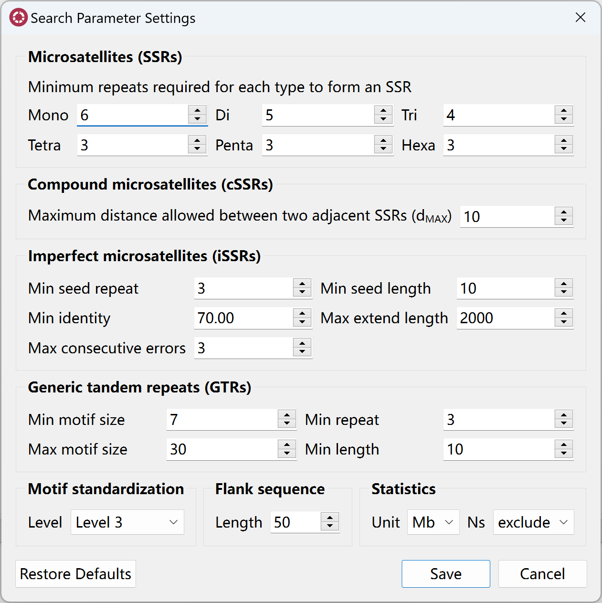
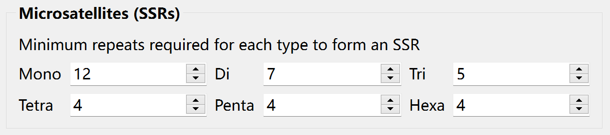
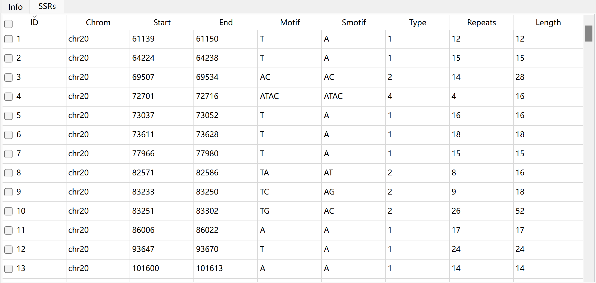
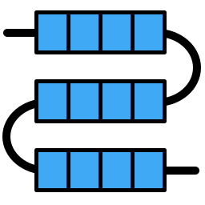
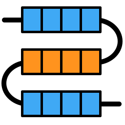
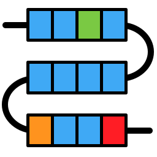
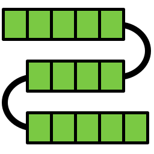

Import Files
============

Import Sequence Files
---------------------

Krait2 supports fasta and fastq formatted sequence files as well as the gzip compressed fasta/q files.

#. Go to **File** menu, click **Import sequence files...** to open file select dialog, select sequence files, and then click **Open** to import files.

#. Or, you can go to **File** menu, click **Import sequence files from folder...** to open folder select dialog, select a folder, and then click **Select Folder** to import all sequence files in that folder.

Import Annotation Files
-----------------------

Currently, Krait2 supports GTF and GFF formatted annotation files as well as the gzip compressed gtf/gff files.

#. Go to **File** menu, click **Import annotation files...** to open file select dialog, select annotation files, and then click **Open** to import files.

#. Or, you can go to **File** menu, click **Import annotation files from folder...** to open folder select dialog, select a folder, and then click **Select Folder** to import all annotation files in that folder.

.. note::

	The annotation file name must be consistent with the corresponding sequence file. When the annotation file is imported, the krait2 will automatically match it with the sequence file. If a match is found, the sequence file name in the ``input file list`` will be bolded.

	For example, ``example.fa.gz`` will match with ``example.gtf.gz``, keep the names before the first dot are the same, they can be recognized.

Search for Repeats
==================

Prior to search for repeats, you can go to **Edit** menu, click **Repeat search settings** to open search parameter setting dialog to set corresponding paramters.

Search for Perfect SSRs
-----------------------

Before searching for perfect SSRs, you can set the minimum tandem repeat number for mono-, di-, tri-, tetra-, penta-, hexa-nucleotide SSRs, separately.

Go to **Toolbar**, and then click |ssr| to start search for perfect SSRs. After searching, you can click the file in ``input file list`` to view results in SSRs table.

The description of each column in table:

+----------+--------------------------------------------------------------------------+
|  column  | description                                                              |
+==========+==========================================================================+
| ID       | unique identifier generated by Krait                                     |
+----------+--------------------------------------------------------------------------+
| chrom    | the name of sequence where SSR was found                                 |
+----------+--------------------------------------------------------------------------+
| start    | start position of SSR in original sequence, 1-based                      |
+----------+--------------------------------------------------------------------------+
| end      | end position of SSR in original sequence, 1-based                        |
+----------+--------------------------------------------------------------------------+
| motif    | repeat unit of SSR                                                       |
+----------+--------------------------------------------------------------------------+
| smotif   | the standardized motif                                                   |
+----------+--------------------------------------------------------------------------+
| type     | SSR type or motif length                                                 |
+----------+--------------------------------------------------------------------------+
| repeats  | number of repeats                                                        |
+----------+--------------------------------------------------------------------------+
| length   | the length of SSR (bp)                                                   |
+----------+--------------------------------------------------------------------------+

Search for Compound SSRs
------------------------

Search for Imperfect SSRs
-------------------------

Search for Generic Tandem Repeats
---------------------------------

