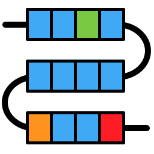
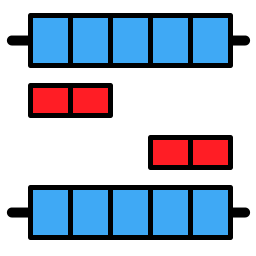

Main Window
===========

|overview|

Krait2 graphical user interface is devided in five areas.

1.Toolbar
---------
	
* |ssr| search for perfect microsatellites.

* |cssr| search for compound microsatellites.

* |gtr| search for generic tandem repeats with any motif length.

* |issr| search for imperfect microsatellites.

* |locating| mapping microsatellites to gene features such as CDS, UTR, intron.

* |primer| design primers for selected microsatellites.

* |statistics| perform statistics analysis.

* |filter| filter the rows in current table.

2.Input File List
------------------

The imported fasta/q file name will listed in this area.

3.Main view
-----------

When clicking the file name in input file list, this view will display the corresponding file information, microsatellite tables, primer table and statistics information.

	|fileinfo|

4.Annotation Tree
-----------------

When there are microsatellites in the current table, click the annotated microsatellites, the annotation tree will display the gene feature information in where microsatellite located.

	|annotree|

5.Sequence and Alignment Viewer
-------------------------------

When clicking a microsatellite in current table, its sequence and flanking sequence will be displayed in sequence viewer. 

	|seqview|

If the clicked microsatellite is imperfect, the alignment between it and the perfect counterpart will be displayed in alignment viewer.

	|seqaln|

.. |overview| image:: _static/overview.png
.. |ssr| image:: _static/ssr.svg
	:width: 20
.. |cssr| image:: _static/cssr.svg
	:width: 20

.. |gtr| image:: _static/gtr.svg
	:width: 20
.. |locating| image:: _static/locating.svg
	:width: 20

.. |filter| image:: _static/filter.svg
	:width: 20

